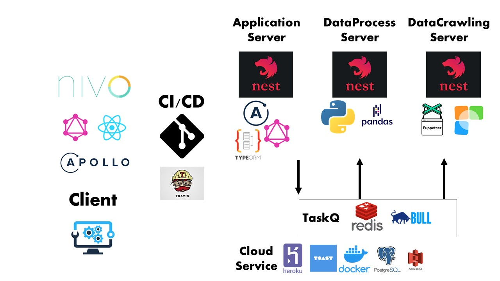

<h1 align="center">Welcome to 호재조 🚀</h1>
<p>
  
  <a href="#" target="_blank">
    
  </a>
</p>

## AI 뉴스 요약 & 가격 예측

## 프로젝트 아키텍쳐



## Module - 개발 계획 (Notion)

[https://www.notion.so/momo-b39ba2d95a384acc89e700f4b0d96355](https://www.notion.so/momo-b39ba2d95a384acc89e700f4b0d96355)

</details>

## Author

👤 **doyoungkim**

- Website: https://www.notion.so/dosimpact/Kim-Do-Young-623609d5699849b3a5db5b1cc248c609
- Github: [@dosimpact](https://github.com/dosimpact)

## Show your support

Give a ⭐️ if this project helped you!

---

_This README was generated with ❤️ by [readme-md-generator](https://github.com/kefranabg/readme-md-generator)_

```

```
