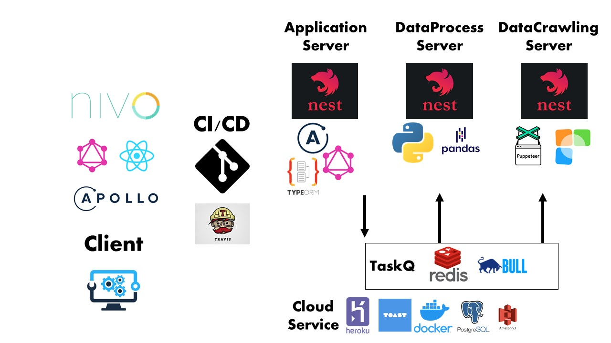

<h1 align="center">Welcome to 호재조 👋</h1>
<p>
  
  <a href="#" target="_blank">
    
  </a>
</p>

## 주식 AI 로보어드바이저 플랫폼

### (투자 자산 AI 포트폴리오 및 백테스팅 플랫폼 )

## 문제 정의

불로소득의 중요성이 점차 증가함에 따라 청년층의 투자자산 거래가 늘고 있는 추세다.
하지만 재무 지식 결여와 심리적인 요인때문에 매수,매도 시점을 감으로 판단하고 있다.

## 해결 방안

퀀트투자는 데이터 기반으로 투자자산에 대한 도움을 줄 수 있는 지표를 제공해준다. 더 이상 감으로 주식을 투자하지말고 직접 데이터를 보고 전략을 테스팅해서 스스로 판단할 수 있도록 돕는 플랫폼을 구축하고자 한다.

## 플랫폼 소개

재무제표 오픈 API와 파이낸스 DB로 기업 정보 및 주식 데이터를 제공해주며 주가 예측 모의고사를 통해 기업을 공부 할 수 있으며 커뮤니케이션 서비스를 제공. 나아가 퀀트 투자 전략 및 테스팅으로 제공하여 스스로 투자 전략을 검증하고 실거래에 사용하도록 하는것이 목표

## 프로젝트 아키텍쳐



## Install

```sh
yarn install
```

## Setting (.env example)

```
MAINTAINER = xxx # env,Joi,configService 동작을 점검

DATABASE_URL = DATABASE_URL #  Heroku 에서 제공하는 env key와 동일하게 설정
PORT = 4000  # Heroku 가 제공하는 env key와 동일하게 설정
JWT_KEY = JWT_KEY
PYTHON_PATH = pythonPath

REDIS_HOST = localhost
REDIS_PORT = 6379
```

## Usage

```sh
yarn start:dev
```

## Run tests

```sh
yarn test:cov
```

## Module - 개발 계획 (Notion)

[https://www.notion.so/momo-b39ba2d95a384acc89e700f4b0d96355](https://www.notion.so/momo-b39ba2d95a384acc89e700f4b0d96355)

</details>

## Author

👤 **doyoungkim**

- Website: https://www.notion.so/dosimpact/Kim-Do-Young-623609d5699849b3a5db5b1cc248c609
- Github: [@dosimpact](https://github.com/dosimpact)

## Show your support

Give a ⭐️ if this project helped you!

---

_This README was generated with ❤️ by [readme-md-generator](https://github.com/kefranabg/readme-md-generator)_

```

```
